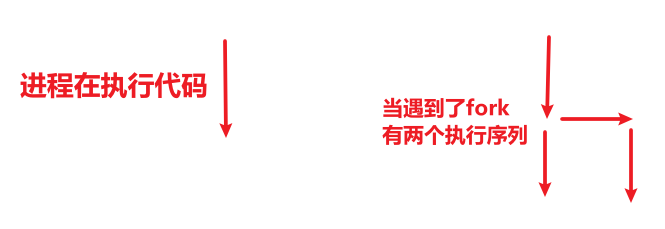

# 实验3 进程运行轨迹的跟踪与统计

## 实验前

本实验是 [操作系统之进程与线程 - 网易云课堂](https://mooc.study.163.com/course/1000002008#/info) 的配套实验，需要对进程的生命周期和状态有初步的了解才能做这个实验，推荐大家进行实验之前先学习相关课程：

* L8 CPU 管理的直观想法
* L9 多进程图像

如果网易云上的课程无法查看，请移步 Bilibili [操作系统哈尔滨工业大学李治军老师](https://www.bilibili.com/video/av17036347)。

难度系数：★★★☆☆


## 实验目的

* 掌握Linux下的多进程编程技术；
* 通过对进程运行轨迹的跟踪来形象化进程的概念；
* 在进程运行轨迹跟踪的基础上进行相应的数据统计，从而能对进程调度算法进行实际的量化评价，更进一步加深对调度和调度算法的理解，获得能在实际操作系统上对调度算法进行实验数据对比的直接经验。


## 实验内容

进程从创建（Linux 下调用 fork()）到结束的整个过程就是进程的生命期，进程在其生命期中的运行轨迹实际上就表现为进程状态的多次切换，如进程创建以后会成为就绪态；当该进程被调度以后会切换到运行态；在运行的过程中如果启动了一个文件读写操作，操作系统会将该进程切换到阻塞态（等待态）从而让出 CPU；当文件读写完毕以后，操作系统会在将其切换成就绪态，等待进程调度算法来调度该进程执行……

1. 基于模板 process.c编写多进程的样本程序，实现如下功能：

   所有子进程都并行运行，每个子进程的实际运行时间一般不超过 30 秒；

   父进程向标准输出打印所有子进程的 id，并在所有子进程都退出后才退出；

2. 在 Linux0.11上实现进程运行轨迹的跟踪：基本任务是在内核中维护一个日志文件 /var/process.log，把从操作系统启动到系统关机过程中所有进程的运行轨迹都记录在这一 log 文件中。

3. 在修改过的 0.11 上统计进程时间：运行样本程序，通过分析 log 文件，统计该程序建立的所有进程的等待时间、完成时间（周转时间）和运行时间，然后计算平均等待时间，平均完成时间和吞吐量。可以自己编写统计程序，也可以使用 python 脚本程序—— stat_log.py（在 /home/teacher/ 目录下） ——进行统计。

4. 修改0.11进程调度时间片，再次统计：修改 0.11 进程调度的时间片，然后再运行同样的样本程序，统计同样的时间数据，和原有的情况对比，体会不同时间片带来的差异。

   

   

/var/process.log 文件的格式必须为：

```
pid    X    time 
```

其中：

* pid 是进程的 ID；
* X 可以是 N、J、R、W 和 E 中的任意一个，分别表示进程新建(N)、进入就绪态(J)、进入运行态®、进入阻塞态(W) 和退出(E)；
* time 表示 X 发生的时间。这个时间不是物理时间，而是系统的滴答时间(tick)；三个字段之间用制表符分割。

三个字段之间用制表符分隔。例如：

```
12    N    1056
12    J    1057
4    W    1057
12    R    1057
13    N    1058
13    J    1059
```


## 实验报告

完成实验后，在实验报告中回答如下问题：

* 结合自己的体会，谈谈从程序设计者的角度看，单进程编程和多进程编程最大的区别是什么？
* 你是如何修改时间片的？仅针对样本程序建立的进程，在修改时间片前后，log 文件的统计结果（不包括 Graphic）都是什么样？结合你的修改分析一下为什么会这样变化，或者为什么没变化？

## 评分标准

* process.c，50%
* 日志文件建立成功，5%
* 能向日志文件输出信息，5%
* 5 种状态都能输出，10%（每种 2 %）
* 调度算法修改，10%
* 实验报告，20%


## process.c

`process.c` 的编写涉及到 `fork()` 和 `wait()` 系统调用，请自行查阅相关文献。

0.11 内核修改涉及到 `init/main.c`、`kernel/fork.c` 和 `kernel/sched.c`，开始实验前如果能详细阅读《注释》一书的相关部分，会大有裨益。


原始文件内容如下： 命名为process-init.c

```C
#include <stdio.h>
#include <unistd.h>
#include <time.h>
#include <sys/times.h>

#define HZ	100

void cpuio_bound(int last, int cpu_time, int io_time);

int main(int argc, char * argv[])
{
	return 0;
}

/*
 * 此函数按照参数占用CPU和I/O时间
 * last: 函数实际占用CPU和I/O的总时间，不含在就绪队列中的时间，>=0是必须的
 * cpu_time: 一次连续占用CPU的时间，>=0是必须的
 * io_time: 一次I/O消耗的时间，>=0是必须的
 * 如果last > cpu_time + io_time，则往复多次占用CPU和I/O
 * 所有时间的单位为秒
 */
void cpuio_bound(int last, int cpu_time, int io_time)
{
	struct tms start_time, current_time;
	clock_t utime, stime;
	int sleep_time;

	while (last > 0)
	{
		/* CPU Burst */
		times(&start_time);
		/* 其实只有t.tms_utime才是真正的CPU时间。但我们是在模拟一个
		 * 只在用户状态运行的CPU大户，就像“for(;;);”。所以把t.tms_stime加上很合理。
		 */
		do
		{
			times(&current_time);
			utime = current_time.tms_utime - start_time.tms_utime;
			stime = current_time.tms_stime - start_time.tms_stime;
		} while ( ( (utime + stime) / HZ )  < cpu_time );
		last -= cpu_time;

		if (last <= 0 )
			break;

		/* IO Burst */
		/* 用sleep(1)模拟1秒钟的I/O操作 */
		sleep_time=0;
		while (sleep_time < io_time)
		{
			sleep(1);
			sleep_time++;
		}
		last -= sleep_time;
	}
}
```

主要定义了一个`cpuio_bound`函数。这个函数的作用：根据参数，占用CPU和IO的时间。参数的作用请见注释；假设last=10，cpu_time = 3, io_time=2  那么总共会占用10s，其中cpu_time占用6秒，io_time占用4秒。cpu_time和io_time可以理解为占用的比例。

我们来解读下这段代码：首先定义了2个结构体变量，`struct tms start_time, current_time;`  tms结构体如下：

```C
strace tms{
 clock_t tms_utime;   	//记录的是进程执行用户代码的时间.
 clock_t tms_stime; 	//记录的是进程执行内核代码的时间.
 clock_t tms_cutime;	//记录的是子进程执行用户代码的时间.
 clock_t tms_cstime;	//记录的是子进程执行内核代码的时间.
}
```

第32行：times函数就是用来给start_time里的4个clock_t变量赋值，第38行同理。

第39行：通过两者时间相减，得到用户态时间差utime。第40行同理。

然后用户态时间差+内核态时间差，除以 HZ ；因为utime和stime是嘀嗒数，除以赫兹。等循环够久了，那么utime和stime就会越来越大，直到超过cpu_time 

然后 `last -= cpu_time;`  就是得到IO应该用的时间。然后我们用sleep模拟IO。


完整process.c

```c
#include <stdio.h>
#include <unistd.h>
#include <time.h>
#include <sys/times.h>
#include <sys/wait.h>
#include <sys/types.h>

#define HZ	100

void cpuio_bound(int last, int cpu_time, int io_time);

int main(int argc, char * argv[])
{
	pid_t father,son1,son2,son3,tmp1,tmp2,tmp3;
	tmp1=fork();
	if(tmp1==0)			/* son1 */
	{
		son1=getpid();
		printf("The son1's pid:%d\n",son1);
		printf("I am son1\n");
		cpuio_bound(10, 3, 2);
		printf("Son1 is finished\n");
	}
	else if(tmp1>0)
	{
		son1=tmp1;
		tmp2=fork();
		if(tmp2==0)		/* son2 */
		{
			son2=getpid();
			printf("The son2's pid:%d\n",son2);
			printf("I am son2\n");
			cpuio_bound(5, 1, 2);
			printf("Son2 is finished\n");
		}
		else if(tmp2>0)		/* father */
		{
			son2=tmp2;
			father=getpid();
			printf("The father get son1's pid:%d\n",tmp1);
			printf("The father get son2's pid:%d\n",tmp2);
			wait((int *)NULL);
			wait((int *)NULL);
			printf("Now is the father's pid:%d\n",father);
		}
		else
			printf("Creat son2 failed\n");
	}
	else
		printf("Creat son1 failed\n");
	return 0;
}

/*
 * 此函数按照参数占用CPU和I/O时间
 * last: 函数实际占用CPU和I/O的总时间，不含在就绪队列中的时间，>=0是必须的
 * cpu_time: 一次连续占用CPU的时间，>=0是必须的
 * io_time: 一次I/O消耗的时间，>=0是必须的
 * 如果last > cpu_time + io_time，则往复多次占用CPU和I/O
 * 所有时间的单位为秒
 */
void cpuio_bound(int last, int cpu_time, int io_time)
{
	struct tms start_time, current_time;
	clock_t utime, stime;
	int sleep_time;

	while (last > 0)
	{
		/* CPU Burst */
		times(&start_time);
		/* 其实只有t.tms_utime才是真正的CPU时间。但我们是在模拟一个
		 * 只在用户状态运行的CPU大户，就像“for(;;);”。所以把t.tms_stime
		 * 加上很合理。*/
		do
		{
			times(&current_time);
			utime = current_time.tms_utime - start_time.tms_utime;
			stime = current_time.tms_stime - start_time.tms_stime;
		} while ( ( (utime + stime) / HZ )  < cpu_time );
		last -= cpu_time;

		if (last <= 0 )
			break;

		/* IO Burst */
		/* 用sleep(1)模拟1秒钟的I/O操作 */
		sleep_time=0;
		while (sleep_time < io_time)
		{
			sleep(1);
			sleep_time++;
		}
		last -= sleep_time;
	}
}
```


然后我们开始讲解编写好了的代码。首先我们定义几个pid_t变量（进程号，其实就是int类型）。

然后我们用fork() 创建子进程，关于fork的说明可以参考《Linux内核完全剖析》的第8.10节，fock.c程序。fork一次调用，2次返回，可以[fork()详解 CSDN博客](https://blog.csdn.net/weixin_41537785/article/details/81157031)。 如果fork返回0，说明是子进程，我们将调用 fork 的进程称之为父进程， 而新的进程称之为子进程。

创建了进程后，相当于开了一个代码执行序列，可能是子进程执行先，也可能是父进程执行




因此这段代码是子进程执行的：子进程里首先获取了自己的PID，然后占用一定的CPU的时间，然后结束

```c
if(tmp1==0)			/* son1 */
	{
		son1=getpid();
		printf("The son1's pid:%d\n",son1);
		printf("I am son1\n");
		cpuio_bound(10, 3, 2);
		printf("Son1 is finished\n");
	}
```


如果tmp1 > 0，说明是父进程，因此else if  里执行的是父进程的代码。主进程又fork了几个进程，代码和if里的分支很类似，wait会等待子进程结束

现在我们可以编译和运行这个函数了


## 参考

* [操作系统原理与实践 - 进程运行轨迹的跟踪与统计 - 蓝桥云课](https://www.lanqiao.cn/courses/115/learning/)
* [times、 time、clock函数说明 - doscho - 博客园](https://www.cnblogs.com/doscho/p/7531346.html)


